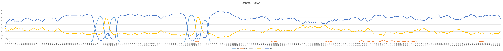
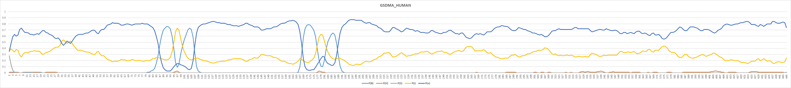
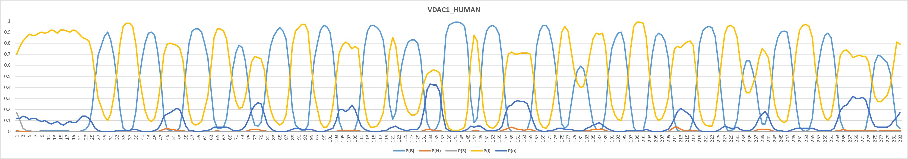
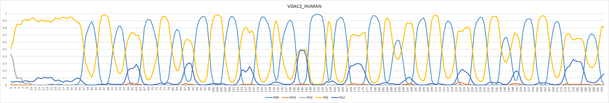
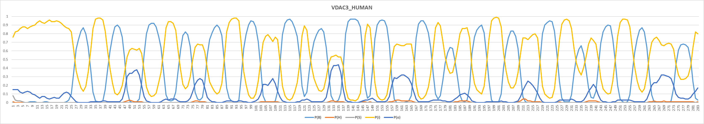

# Example beta barrel protein predictions for the human proteome

Most of the beta barrel transmembrane proteins (TMP) in our data set are bacterial proteins (60 of 65).\
Nevertheless, TMbed predicts several beta barrel TMPs for the human proteome. Here are some examples.

The plots were generated based on the class probabilities in `sample_3.pred`, which uses `--out-format 3`.


## GSDMD_HUMAN Gasdermin-D

TMbed accurately predicts all four transmembrane beta strands (TMB).\
However, this is not too surprising as GSDMD_HUMAN is actually one of the few eukaryotic beta barrel TMPs in our data set.

```
>sp|P57764|GSDMD_HUMAN Gasdermin-D OS=Homo sapiens OX=9606 GN=GSDMD PE=1 SV=1
ooooooooooooooooooooooooooooooooooooooooooooooooooooooooooooooooooooooooooooooooooooooooBBBBBBBBBiiiiiBBBBBBBoooooooooooooooooooooooooooooooooooooooooooooooooooooooooooooooooooooBBBBBBBBiiiiiiBBBBBBoooooooooooooooooooooooooooooooooooooooooooooooooooooooooooooooooooooooooooooooooooooooooooooooooooooooooooooooooooooooooooooooooooooooooooooooooooooooooooooooooooooooooooooooooooooooooooooooooooooooooooooooooooooooooooooooooooooooooooooooooooooooooooooooooooooooooooooooooooooooooooooo
```




## GSDMA_HUMAN Gasdermin-A

For GSDMA_HUMAN TMbed correctly predicts four TMBs.\
You can see that there is a bit of uncertainty regarding the per-residue inside/outside predictions near the N-terminus. Nevertheless, this has no negative impact on the overall orientation of the predicted TMB segments.

```
>sp|Q96QA5|GSDMA_HUMAN Gasdermin-A OS=Homo sapiens OX=9606 GN=GSDMA PE=1 SV=4
ioooooooooooooooooooooooooooooiiioiiooooooooooooooooooooooooooooooooooooooooooooooooooBBBBBBBBiiiiiBBBBBBBooooooooooooooooooooooooooooooooooooooooooooooooooooooooooooooBBBBBBBBiiiiiiBBBBBBooooooooooooooooooooooooooooooooooooooooooooooooooooooooooooooooooooooooooooooooooooooooooooooooooooooooooooooooooooooooooooooooooooooooooooooooooooooooooooooooooooooooooooooooooooooooooooooooooooooooooooooooooooooooooooooooooooooooooooooooooooooooooooooooo
```




## VDAC1_HUMAN Voltage-dependent anion-selective channel protein 1

TMbed correctly predicts 18 of the 19 TMBs in VDAC1_HUMAN.\
It also seems to be a bit confused about the per-residue inside/outside predictions; predicting mostly "inside" for the non-transmembrane residues. The lack of eukaryotic beta barrel TMPs coud be a reason for this uncertainty.

```
>sp|P21796|VDAC1_HUMAN Voltage-dependent anion-selective channel protein 1 OS=Homo sapiens OX=9606 GN=VDAC1 PE=1 SV=2
iiiiiiiiiiiiiiiiiiiiiiiiioBBBBBBiiiiiiiiBBBBBBoiiiiiiioBBBBBBBiiiiiiiBBBBBoiiiioBBBBBBBBiiiiiiiBBBBBBBoiiiiiiioBBBBBBBBiiiiBBBBBBBBoiiioBBBBBBBBBiiiiBBBBBBBoiiiiiiiioBBBBBBBiiiiiiiiiiiiiiiioBBBBBBiiiiiiiBBBBBBoiiiiiiioBBBBBBBiiiiiiiBBBBBoiiioBBBBBBiiiiiiiiBBBBBBoiiiiiiiiiioBBBBBBiii
```

However, the Viterbi decoder is forced to make a decision about the inside/outside orientation of each TMB.\
Looking at the orientation of the individual TMBs, you can see that each one is correctly predicted. In fact, the orientation indicates the missing TMB inbetween the 11th and 12th predicted TMB.

```
>sp|P21796|VDAC1_HUMAN Voltage-dependent anion-selective channel protein 1 OS=Homo sapiens OX=9606 GN=VDAC1 PE=1 SV=2
..........................bbbbbb........BBBBBB.........bbbbbbb.......BBBBB......bbbbbbbb.......BBBBBBB.........bbbbbbbb....BBBBBBBB.....bbbbbbbbb....BBBBBBB..........bbbbbbb.................bbbbbb.......BBBBBB.........bbbbbbb.......BBBBB.....bbbbbb........BBBBBB............bbbbbb...
```

Though freely changing the per-residue inside/outside orientation might look like a weakness of the Viterbi decoder at first, it is actually a strength in cases like this. If you were to force the Viterbi decoder to commit to a per-residue inside/outside orientation and only change it after a TMB segment, the prediction would be worse. Here TMbed splits the 1st and 14th TMB segments to adhere to the inside/outside change, while still missing the same TMB segment as before.

```
>sp|P21796|VDAC1_HUMAN Voltage-dependent anion-selective channel protein 1 OS=Homo sapiens OX=9606 GN=VDAC1 PE=1 SV=2
iiiiiiiiiiiiiiiiiiiiiiiBBBBBoBBBBBiiiiiiBBBBBBBBoooooBBBBBBBBBiiiiiiiBBBBBBooooBBBBBBBBBiiiiiiiBBBBBBBBoooooooBBBBBBBBBiiiiBBBBBBBBoooooBBBBBBBBBiiiiBBBBBBBBooooooooBBBBBBBBiiiiiiiiiiiiiiiiBBBBBBBBBoooBBBBBBBBiiiiiiBBBBBoBBBBBiiiiiiBBBBBBooBBBBBBBBiiiiiiiiBBBBBBBooooooooooBBBBBBBiii
```

If you take a closer look at the per-residue class probabilities, you might notice two things:
- There is a peak for P(B) where the missing TMB should be located (178-185). Though, it is too narrow to be predicted as a TMB.
- The "outside" non-transmembrane regions have an elevated P(o), which enables the Viterbi decoder to pick up the orientation of the TMBs.




## VDAC2_HUMAN Voltage-dependent anion-selective channel protein 2

VDAC2_HUMAN exhibits a similar pattern to VDAC1_HUMAN. However, here TMbed correctly predicts all 19 TMBs.

```
>sp|P45880|VDAC2_HUMAN Voltage-dependent anion-selective channel protein 2 OS=Homo sapiens OX=9606 GN=VDAC2 PE=1 SV=2
iiiiiiiiiiiiiiiiiiiiiiiiiiiiiiiiiiiioBBBBBBiiiiiiiiBBBBBBoiiiiiioBBBBBBBBiiiiiiiBBBBBoiiiioBBBBBBBBiiiiiiiBBBBBBBoiiiiiiioBBBBBBBBiiiiBBBBBBBBoooioBBBBBBBBBiiiiBBBBBBBoiiiiiiiioBBBBBBBiiiiiBBBBBoiiiiioBBBBBBiiiiiiBBBBBBBoiiiiiiioBBBBBBBiiiiiiiBBBBBoiiioBBBBBBBiiiiiiiBBBBBBoiiiiiiiiiioBBBBBBiii
```




## VDAC3_HUMAN Voltage-dependent anion-selective channel protein 3

The prediction for VDAC3_HUMAN contains all 19 TMBs, similar to VDAC2_HUMAN.

```
>sp|Q9Y277|VDAC3_HUMAN Voltage-dependent anion-selective channel protein 3 OS=Homo sapiens OX=9606 GN=VDAC3 PE=1 SV=1
iiiiiiiiiiiiiiiiiiiiiiiiioBBBBBBiiiiiiiiBBBBBBBoiiiiioBBBBBBBBiiiiiiiBBBBBoiiiioBBBBBBBBiiiiiiiBBBBBBBoiiiiiiioBBBBBBBBiiiiBBBBBBBoiiiioBBBBBBBBBiiiiBBBBBBBoiiiiiiiioBBBBBBBiiiiiBBBBBoiiiiioBBBBBBiiiiiiiBBBBBBoiiiiiiioBBBBBBBiiiiiiiBBBBBoiiioBBBBBBiiiiiiiiBBBBBBoiiiiiiiiiioBBBBBBiii
```


